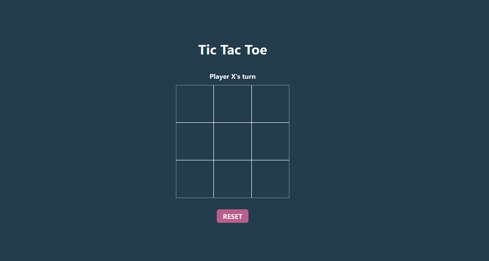
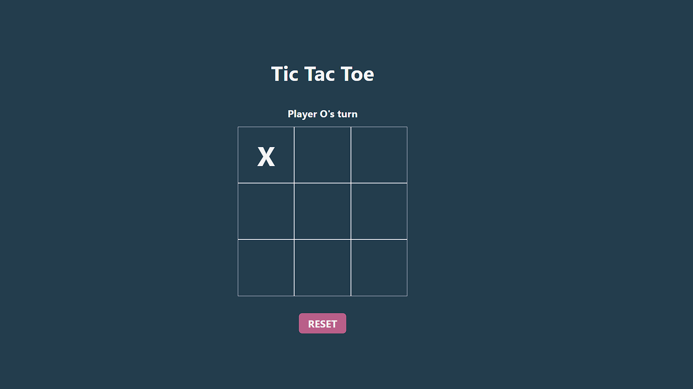
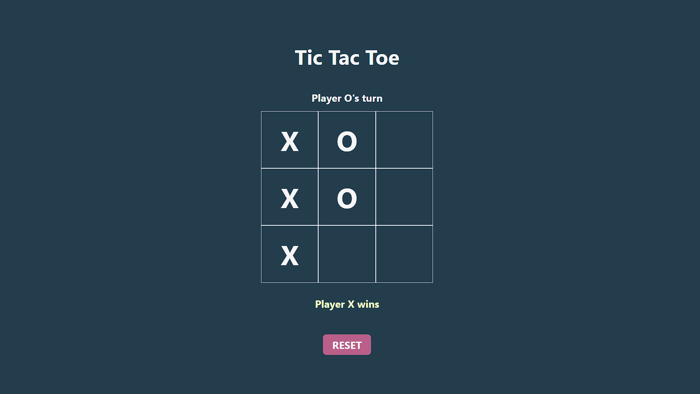
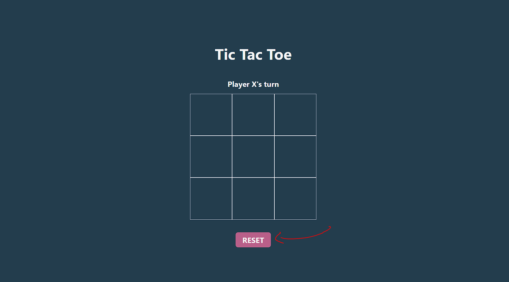

<h1>TicTacToe</h1>

Just a Simple Tic Tac Toe game made with Vue.js.

First player "X" plays and then it is "O"'s turn.

When someone wins, the game ends and the winner appears at the bottom of the board.

You can restart the game by clicking on the "RESET" button.

<h1>Run the Project and Play</h1>

To run and play the game you need to follow these steps:

<ul>
  <li>Clone this repository</li>
  <li>Open the code on your IDE</li>
  <li>Run code using 'npm run dev'</li>
</ul>
